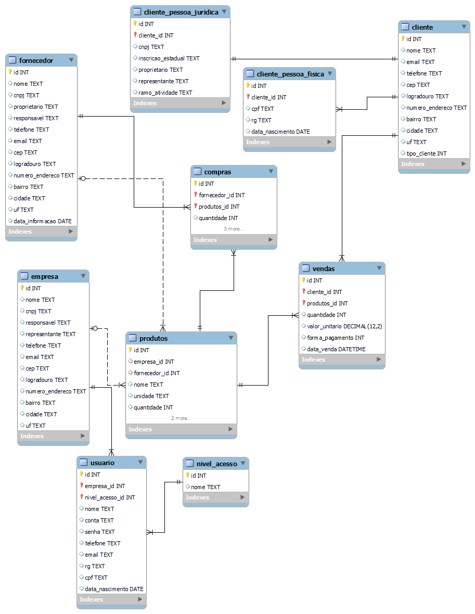

# app-loja-frutas

Construção de aplicativo web para gerenciamento de compras e vendas de lojas de frutas, como atividade prática da disciplina de Eletiva I.

Faz uso das linguagens de programação JavaScript e Java e dos recursos Spring Boot, Maven, JPA/Hibernate, H2 e Thymeleaf.

O projeto até agora implementa operações básicas de CRUD para as entidades definidas no banco de dados, além de formulários que auxiliam essas operações.

Segue o diagrama entidade relacionamento proposto:

